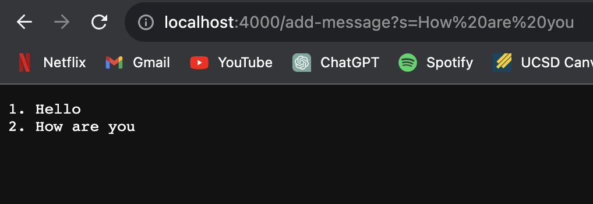
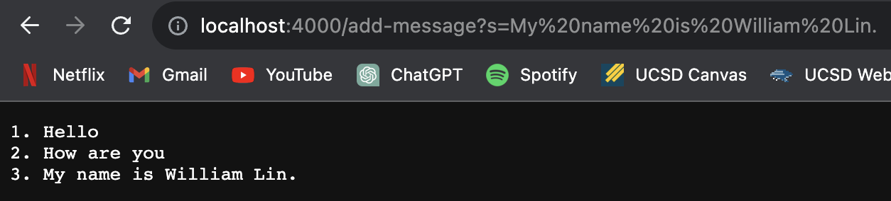
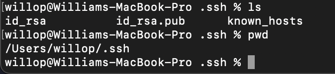
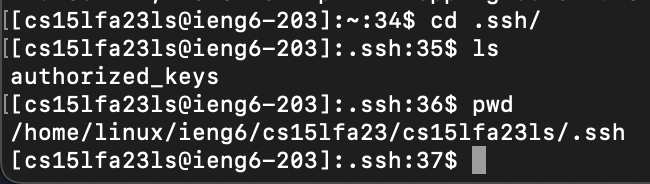
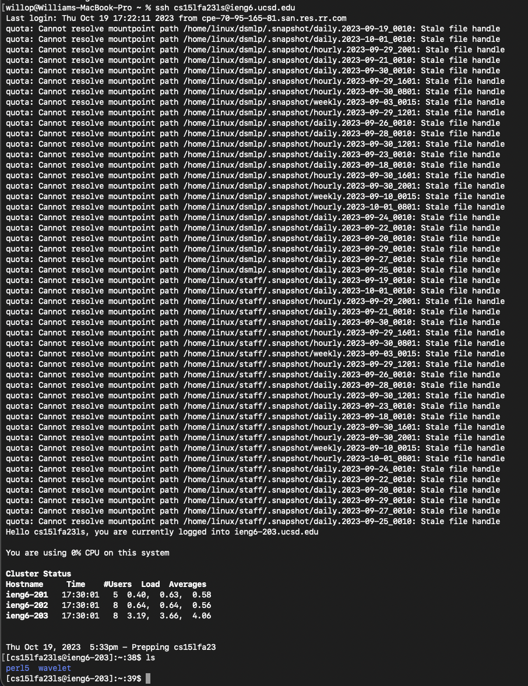

## Week 3 - Lab Report 2 - William Lin (A17402486)

2023/10/17 Tuesday 12:00 ~ 1:50  

> Part 1
```
import java.io.IOException;
import java.net.URI;
import java.util.ArrayList;

class Handler implements URLHandler {
    // The one bit of state on the server: a number that will be manipulated by
    // various requests.
    int num = 1;
    ArrayList<String> words = new ArrayList<>();

    public String handleRequest(URI url) {
        if (url.getPath().equals("/")) {
            String ans = "";
            for(int i = 0; i < words.size(); i++){
                ans += words.get(i);
            }
            return ans;
        } else {
            if (url.getPath().contains("/add-message")) {
                String[] parameters = url.getQuery().split("=");
                if (parameters[0].equals("s")) {
                    words.add(num + ". " + parameters[1] + "\n");
                    num += 1;
                    String ans = "";
                    for(int i = 0; i < words.size(); i++){
                        ans += words.get(i);
                    }
                    return ans;
                }
            }
            return "404 Not Found!";
        }
    }
}

class StringServer {
    public static void main(String[] args) throws IOException {
        if(args.length == 0){
            System.out.println("Missing port number! Try any number between 1024 to 49151");
            return;
        }

        int port = Integer.parseInt(args[0]);

        Server.start(port, new Handler());
    }
}
```

> Screenshot 1


- The handleRequest function is called.
- The handleRequest is called when "/" or "/add-message" appeared in the path of the URL. Path other than those two path, the function will return a string telling the user that that page is not found, which shows "404 Not Found!". num variable is used to keep track of the index of the current word in the ArrayList words. ArrayList words stored all the word added.
- I set a integer variable num that starts at 1 and increment as words are added into the ArrayList words. The ArrayList words is instantiated along with num at the beginning of the function. In screenshot 1, what ever words after "/add-messsage?s=" is stored in the ArrayList words with num value 1 + the string parsed into parameters[1] "How are you" and also "\n" which switch to a new line.


> Screenshot 2


- The handleRequest function is called.
- The handleRequest is called when "/" or "/add-message" appeared in the path of the URL. Path other than those two path, the function will return a string telling the user that that page is not found, which shows "404 Not Found!". num variable is used to keep track of the index of the current word in the ArrayList words. ArrayList words stored all the word added.
- In screenshot 2, num is increased to 2 and stored with the ArrayList words and is updated with the new words "My name is William Lin."

> Part 2





> Part 3

I learned quit a lot in these 2 weeks. ssh is a new command for me and I think it's really cool how you can remotely control other computer on our own computer. Setting up the private and public key is really confusing to me at frist but I manage to understand it a little bit more now and know its usage and some meaning behind it.  

