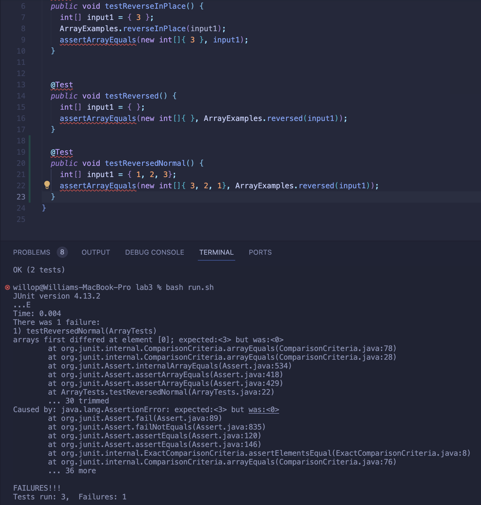

## Week 5 - Lab Report 3 - William Lin (A17402486)

2023/10/31 Tuesday 12:00 ~ 1:50  

> Part 1 - Bugs

A failure-inducing input
```
@Test
  public void testReversedNormal() {
    int[] input1 = { 1, 2, 3};
    assertArrayEquals(new int[]{ 3, 2, 1}, ArrayExamples.reversed(input1));
  }

Output:
1) testReversedNormal(ArrayTests)
arrays first differed at element [0]; expected:<3> but was:<0>
```
- There are bugs in the reversed method, so any array that isn't size 0 or 1 will result in a failure-inducing input. 

An input that doesn’t induce a failure
```
@Test
  public void testReversed() {
    int[] input1 = { };
    assertArrayEquals(new int[]{ }, ArrayExamples.reversed(input1));
  }

Output:
OK (2 tests)
```
- The above test doesn't result in test failure because the element position when array size are 0 or 1 won't change. 

The symptom, as the output of running the tests


The bug, as the before-and-after code change required to fix it 
Before:
```
 static int[] reversed(int[] arr) {
    int[] newArray = new int[arr.length];
    for(int i = 0; i < arr.length; i += 1) {
      arr[i] = newArray[arr.length - i - 1];
    }
    return arr;
  }
```

After:
```
static int[] reversed(int[] arr) {
    int[] newArray = new int[arr.length];
    for(int i = 0; i < arr.length; i += 1) {
      newArray[i] = arr[arr.length - i - 1];
    }
    return newArray;
  }
```
- The new code fix the issue because it copyed all the elements one by one to a new array newArray and return it. 

> Part 2 - Researching Commands - grep

- -c option 
Output count of mathcing lines

On Files:
```
willop@Williams-MacBook-Pro biomed % pwd
/Users/willop/Desktop/UCSD/CSE15L-FA23/docsearch/technical/biomed
willop@Williams-MacBook-Pro biomed % ls | grep -c "rr"
9
```

On Directory:
```
willop@Williams-MacBook-Pro technical % pwd
/Users/willop/Desktop/UCSD/CSE15L-FA23/docsearch/technical
willop@Williams-MacBook-Pro technical % ls | grep -c "biomed"
1
```


