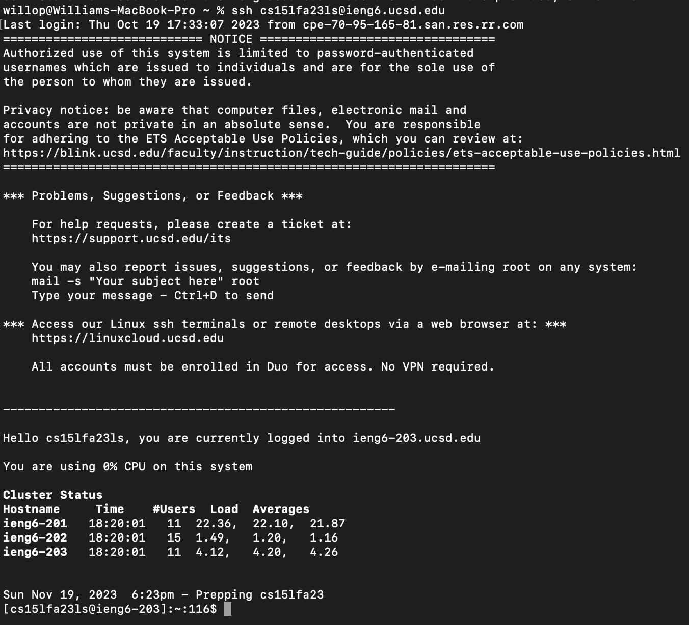
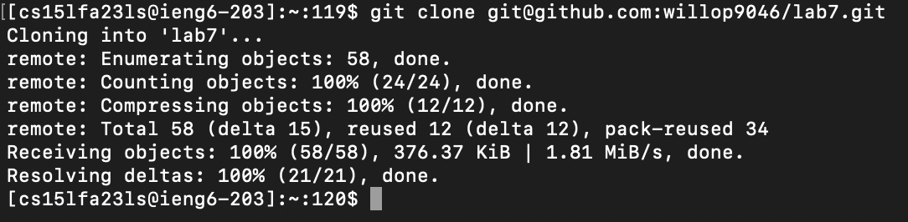
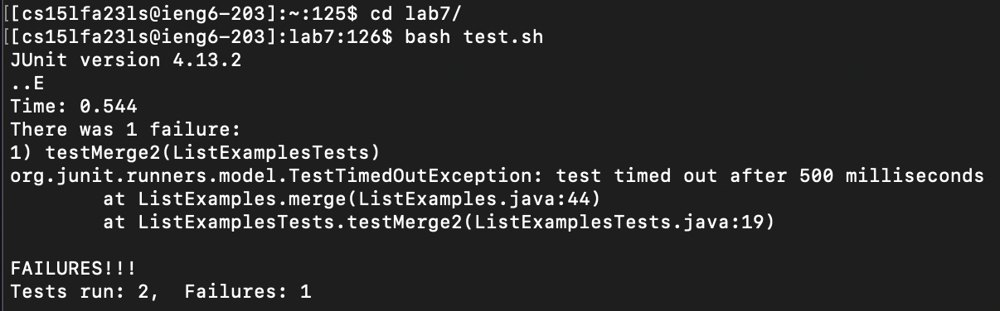
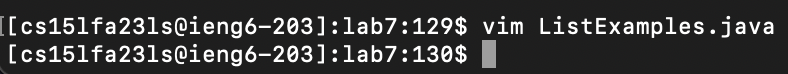
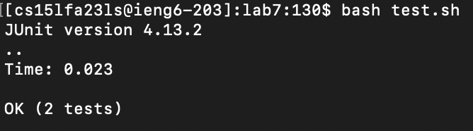
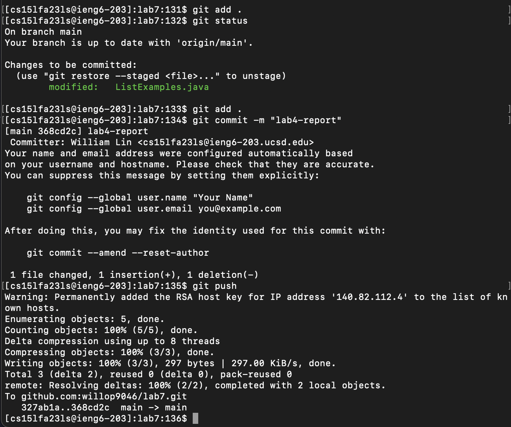

## Week 7 - Lab Report 4 - William Lin (A17402486)

2023/11/14 Tuesday 12:00 ~ 1:50  

> Step 4


Key Pressed
```
<up><enter>
```
The ssh cs15lfa23ls@ieng.ucsd.edu command was 1 up in the search history, so I used up arrow to access it.

> Step 5


Key Pressed
```
git clone <Command-V><enter>
```
I copyied the ssh url from my forked repository and paste the url into terminal.

> Step 6


Key Pressed
```
cd l<tab><enter>
bash t<tab><enter>
```
I used cd command and type l and tab to complete the name of the directory and navigate into lab7/.
Then run the test with bash and type t and tab to auto complete the filename test.sh in lab7/.

> Step 7


Key Pressed
```
vim L<tab>.<tab><enter>
43j11lxi2<esc>:wq<enter>
```
I opened vim editor using vim and the filename. Typing L and tab auto complete the filename, since there are two files that have similar filename, I type another . and tab to auto complete again.
43j move cursor down 43 lines
11l move cursor right 11 characters
x to delete the character currently on
i to enter insert mode
then replace the blank spot with '2'
press ```<esc>``` to enter normal mode
type :wq and ````<enter>```to save the file and quit

> Step 8


Key Pressed
```
<up><up><enter>
```
The bash command was 2 up in the search history, so I used up arrow twice to access it.

> Step 9


Key Pressed
```
git add .<enter>
git status<enter>
git commit -m "lab4-report"<enter>
git push<enter>
```
I used git add to add files with changes to staging state. '.' means add all files.
I used git status to check if file successfully added to staging area.
Then git commit with -m option to give commit a message.
Finally, used git push to update the forked lab7 repository. 
