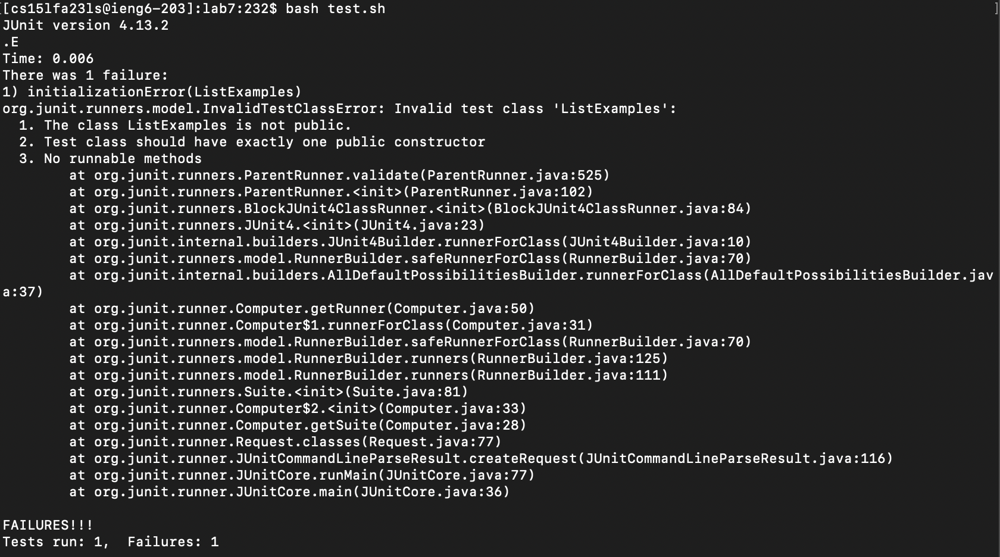
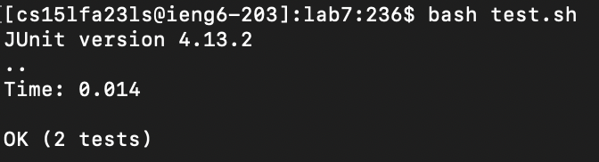

## Week 9 - Lab Report 5 - William Lin (A17402486)

2023/11/28 Tuesday 12:00 ~ 1:50  

> Screenshot Showing a Symptom




The screenshot provided is of a terminal window where a JUnit test has been run, resulting in a failure. The output displayed in the terminal window gives the following failure information:

initializationError(ListExamples)
Invalid test class 'ListExamples':
The class ListExamples is not public.
Test class should have exactly one public zero-argument constructor.
No runnable methods.
These points suggest that the ListExamples test class does not meet the requirements for JUnit test classes. The specific issues are:

The class itself should be declared as public so that JUnit can access it.
There should be a single public constructor that takes no arguments in the ListExamples class. If the constructor is missing or not public, JUnit won't be able to instantiate the test class.
There are no methods annotated with @Test that JUnit can run, or there may be, but they are not accessible due to access modifiers or they do not conform to the requirements (for instance, they should be public, void, and take no arguments).

> TA's Response

From the error output, it looks like JUnit is having trouble initializing your test class. Could you check the access modifier of your ListExamples class and ensure that it's declared as public? Additionally, verify that your class has a public no-argument constructor and at least one public method annotated with @Test.

If everything seems correct on that end, try running the following command in your terminal to list the methods of the ListExamples class:

```
java -cp .:lib/hamcrest-core-1.3.jar:/libjunit-4.13.2.jar org.junit.runner.JunitCore "classpath path_to_your_classes"
```

> Another Screenshot and the Bug


The bug is that the ListExamples class doesn't have any method intended to be a test case and is not annotated with @Test, so JUnit doesn't recognize it as a test to run.

> Setup

The file & directory structure:

root/
- ListExamples.java
- ListExamplesTest.java
- test.sh

The contents of each file before fixing the bug:

test.sh is the only file modofied:

BEFORE -
```
javac -cp .:lib/hamcrest-core-1.3.jar:lib/junit-4.13.2.jar *.java
java -cp .:lib/hamcrest-core-1.3.jar:lib/junit-4.13.2.jar org.junit.runner.JUnitCore ListExamples
```


AFTER -
```
javac -cp .:lib/hamcrest-core-1.3.jar:lib/junit-4.13.2.jar *.java
java -cp .:lib/hamcrest-core-1.3.jar:lib/junit-4.13.2.jar org.junit.runner.JUnitCore ListExamplesTests
```

The full command line (or lines) you ran to trigger the bug:

```
bash test.sh<ENTER>
```

A description of what to edit to fix the bug:

Changed the second line in test.sh from "ListExamples" --> "ListExamplesTests"

> Reflection


One significant learning experience I had during the second half of this quarter was the practical application of bash scripting for automating repetitive tasks. Vim is another skill that has not only made my workflow more efficient but also opened my eyes to the vast potential of simplifying complex tasks. Additionally, the class's focus on bash scripting provided a fun and interactive way to understand the underpinnings of operating systems and command-line interfaces, which I found extremely useful.